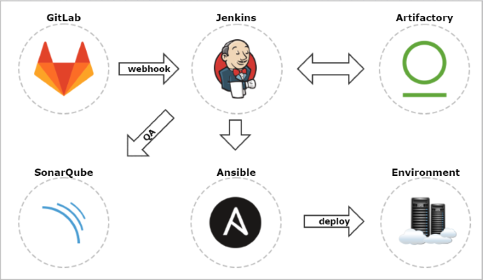

# Using Gitlab & Jenkins

Using Gitlab & Jenkins is a match made in heaven. Both are real FOSS Solutions, with an overwhelming great communities of DevOpsians and Enterprise Engineers.

Here a collection of Articles, Plugins & Howto's;
* [Gitlab Documentation](https://docs.gitlab.com/ee/integration/jenkins.html) 
* [Jenkins Gitlab-Plugin Page](https://plugins.jenkins.io/gitlab-plugin) 
* [Gitlab-Plugin Repo](https://github.com/jenkinsci/gitlab-plugin) 
* [Good Medium Reading 9/16](https://medium.com/@teeks99/continuous-integration-with-jenkins-and-gitlab-fa770c62e88a) 
* [Bitname How-to-do](https://docs.bitnami.com/aws/how-to/create-ci-pipeline/) 
   

Even the scenarios and use cases for jenkins are nearly endless, here is one more ore less "enterprise" standard setup:   

